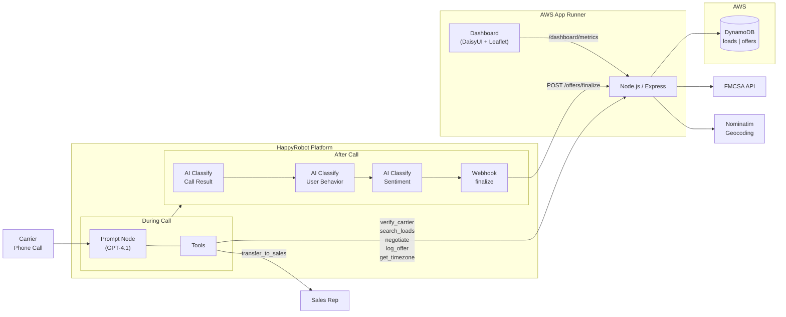

# Inbound Carrier Sales AI Agent

An AI-powered voice agent that handles inbound carrier phone calls for a freight brokerage. Verifies FMCSA authority, matches carriers with loads using geospatial search, negotiates rates through a server-side 3-round engine, and provides a real-time analytics dashboard.

Built with [HappyRobot](https://happyrobot.ai) for voice AI, Node.js/Express for the API, DynamoDB for storage, and deployed on AWS App Runner via Terraform.

## Architecture



## Features

- **Carrier Verification** — Real-time FMCSA authority lookup by MC number
- **Intelligent Load Search** — Geocodes carrier origin, searches 1,500-mile radius via Haversine formula, returns results sorted by proximity with deadhead miles and effective RPM
- **Negotiation Engine** — Server-side 3-round rate negotiation (85% → 90% → 95% → 100% of market rate). The LLM never calculates rates — every pricing decision goes through the API
- **Timezone Handling** — Resolves local date/time per carrier origin so relative dates ("tomorrow", "next Friday") are interpreted correctly across US timezones
- **Analytics Dashboard** — Real-time KPIs, conversion funnel, load map, rate waterfall, negotiation rounds, equipment mix, sentiment breakdown, top lanes/carriers, and activity feed
- **Post-Call Classification** — Three AI classifiers (call result, user behavior, sentiment) chain into a finalize webhook for complete call analytics

## Tech Stack

| Layer | Technology |
|---|---|
| Voice AI | HappyRobot (GPT-4.1, real-time classifiers) |
| API | Node.js 20, Express |
| Database | AWS DynamoDB |
| Compute | AWS App Runner |
| Infrastructure | Terraform, Docker, ECR |
| External APIs | FMCSA SAFER, Nominatim OpenStreetMap |
| Dashboard | DaisyUI, Tailwind CSS, Chart.js, Leaflet.js |

## Quick Start

### Prerequisites

- Node.js 20+, Docker, AWS CLI v2, Terraform 1.5+
- AWS account with ECR/App Runner/DynamoDB/IAM permissions
- FMCSA API key ([register here](https://mobile.fmcsa.dot.gov/QCDevsite/docs/qcApi))
- HappyRobot account ([platform.happyrobot.ai](https://platform.happyrobot.ai))

### 1. Clone and install

```bash
git clone https://github.com/janvdhorst/JanFDE.git
cd JanFDE
npm install
```

### 2. Configure environment

Create a `.envrc` file (gitignored):

```bash
export AWS_ACCESS_KEY_ID=your_key
export AWS_SECRET_ACCESS_KEY=your_secret
export AWS_DEFAULT_REGION=us-east-1
export FMCSA_API_KEY=your_fmcsa_key
export API_KEY_SECRET=$(openssl rand -base64 32)
```

Load it with `direnv allow` or `source .envrc`.

### 3. Run locally

```bash
npm run dev
# API at http://localhost:3000
# Dashboard at http://localhost:3000/dashboard.html?api_key=YOUR_KEY
```

### 4. Deploy to AWS

```bash
./deploy.sh
```

Creates ECR repo, App Runner service, DynamoDB tables, and IAM roles. Outputs the public HTTPS URL.

### 5. Configure HappyRobot

See [docs/setup-guide.md](docs/setup-guide.md) for step-by-step HappyRobot platform configuration (workflow, voice agent, tools, post-call classifiers).

## API Endpoints

| Method | Endpoint | Description |
|---|---|---|
| `GET` | `/health` | Health check (no auth) |
| `GET` | `/carrier/verify/:mc_number` | FMCSA carrier verification |
| `GET` | `/loads` | Search loads (geocoding + radius filter) |
| `GET` | `/loads/:id` | Get a specific load |
| `POST` | `/negotiate` | Rate negotiation engine |
| `POST` | `/offers` | Log a negotiation round |
| `POST` | `/offers/finalize` | Post-call metadata webhook |
| `GET` | `/timezone` | Local date/time for a city |
| `GET` | `/dashboard/metrics` | Aggregated analytics |

All endpoints (except `/health`) require `Authorization: Bearer <API_KEY>`.

## Project Structure

```
├── deploy.sh               # One-command build + deploy
├── Dockerfile               # Multi-stage Node.js container
├── public/
│   └── dashboard.html       # Analytics dashboard
├── src/
│   ├── index.js             # Express app + auth middleware
│   ├── db.js                # DynamoDB client
│   ├── seed.js              # 30 sample loads with dynamic dates
│   └── routes/
│       ├── carrier.js       # FMCSA verification
│       ├── loads.js         # Geospatial load search
│       ├── negotiate.js     # Negotiation engine
│       ├── offers.js        # Offer logging + finalize
│       ├── dashboard.js     # Dashboard metrics
│       └── timezone.js      # Timezone resolution
├── terraform/
│   ├── main.tf              # ECR, App Runner, DynamoDB, IAM
│   ├── variables.tf         # Input variables
│   └── outputs.tf           # Service URL, ECR URI
└── docs/
    ├── build-description.md # Technical build document
    ├── setup-guide.md       # Full reproduction tutorial
    ├── email-carlos.md      # Client email template
    └── video-script.md      # Demo recording script
```

## Documentation

- [Build Description](docs/build-description.md) — Full technical write-up of the system
- [Setup Guide](docs/setup-guide.md) — Step-by-step instructions to reproduce the entire system
- [Video Script](docs/video-script.md) — 5-minute demo walkthrough outline
