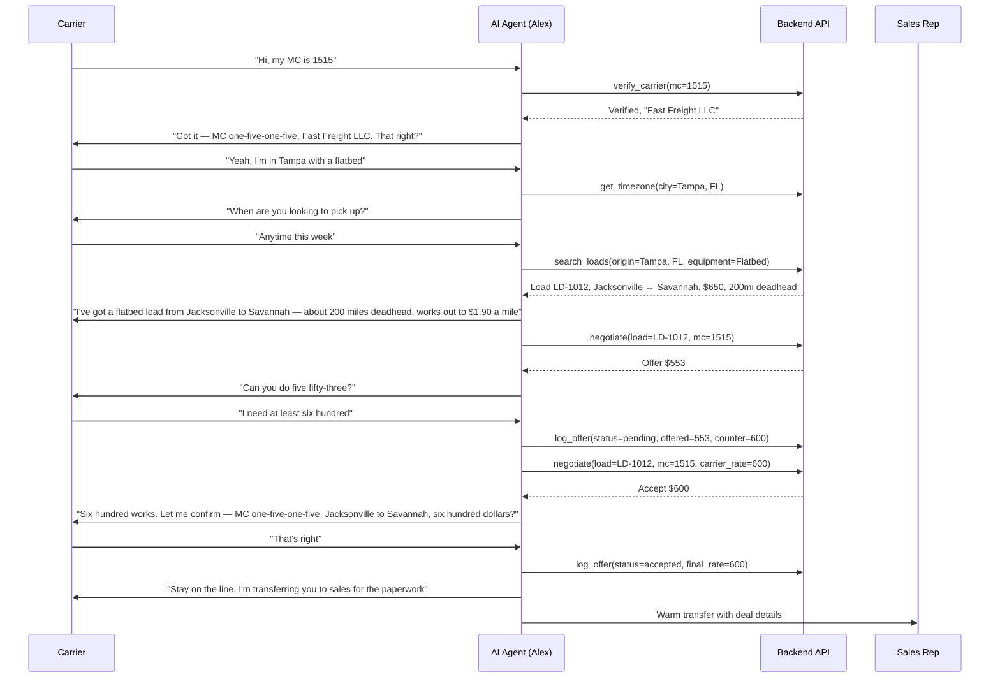
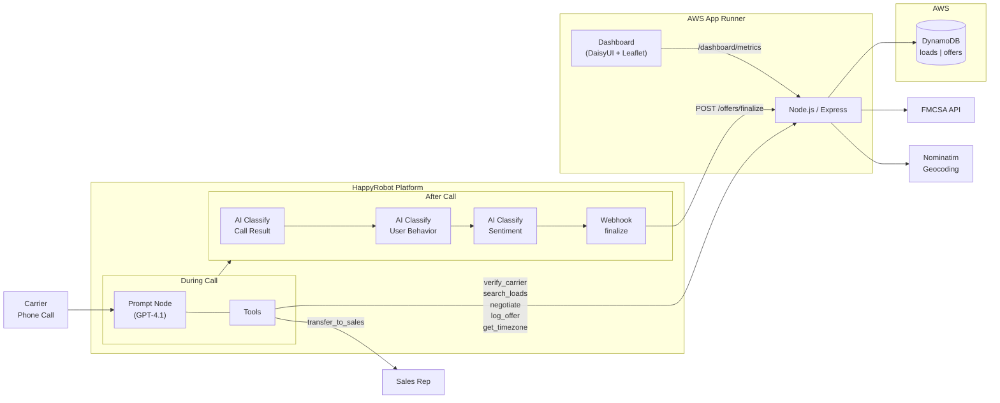

# Inbound Carrier Sales AI — Build Description

**Prepared for:** Acme Logistics
**Prepared by:** Jan van der Horst
**Date:** March 2026

---

## 1. What We Built

An AI voice agent that answers your inbound carrier line 24/7. When a carrier calls looking for a load, the agent handles the entire conversation autonomously — from verifying their authority to negotiating a rate and handing off to your sales team for paperwork. Every call is logged, every negotiation round is tracked, and a live dashboard gives your operations team full visibility.

This is not a chatbot or IVR menu. The agent holds natural, two-way phone conversations. It sounds like an experienced carrier sales rep named Alex.

---

## 2. How a Typical Call Works

### The Happy Path (carrier books a load)

### Carrier Has No Loads Available (silent retry)

The agent doesn't just say "nothing available" on the first miss. It silently relaxes search filters before giving up:

1. Carrier asks for flatbed loads in Tampa on Monday → **no results**
2. Agent drops the date filter and retries → finds a load on Wednesday
3. Agent tells the carrier: "Nothing for Monday, but I've got one picking up Wednesday — would that work?"

If that also fails, it drops the equipment filter. Only after exhausting all options does it tell the carrier the board is empty.

### Carrier is Unauthorized

If the FMCSA check comes back as "Not Authorized" or "Out of Service," the agent reads the specific reason to the carrier, lets them know it can't book them today, and ends the call professionally. No time wasted on either side.

### Carrier Wants to Think About It

The agent doesn't pressure. It gives them the load ID and tells them it's first-come-first-served:

> "No problem at all — the load ID is LD-1012. If you decide you want it, just call us back and reference that number. I can't guarantee it'll still be there, but we'd love to have you."

### Carrier Asks for a Manager

The agent doesn't transfer for manager requests, pricing impasses, or system errors. It stays on the line:

> "I hear you — I'm the one handling loads right now though. Let me see what I can do for you."

Transfers only happen when a price is agreed upon.

---

## 3. Edge Cases the Agent Handles

| Scenario | What the Agent Does |
|---|---|
| **Garbled audio / noisy cab** | Blames the connection, asks them to repeat: "Sorry, getting some static — did you say Reefer or Dry Van?" |
| **Carrier gives city without state** | Asks which state (handles ambiguous names like Springfield, Portland, Columbus) |
| **Carrier says "three dollars a mile"** | Converts rate-per-mile to flat dollar amount using the load's total miles before calling the negotiate tool |
| **Carrier says "next Friday"** | Calls the timezone tool first, counts forward from the carrier's local date |
| **Carrier says "anytime" or "this week"** | Searches without a date filter — doesn't force a specific day |
| **No loads in the area** | Already searched a 1,500-mile radius. Doesn't retry city by city. Asks if the carrier has another area they can run to. |
| **Carrier has multiple trailer types** | Searches without an equipment filter so all matching loads come back in one call |
| **Carrier rejects the final rate** | Offers to search a different lane instead of ending the call |
| **System/API error** | Apologizes and asks them to call back in a few minutes. Never transfers on errors. |
| **Carrier offers less than our floor** | Accepts immediately — they're below our opening offer |
| **Carrier offers more than market rate** | Never pays more than 100% of market. Issues a final offer at ceiling. |

---

## 4. Negotiation Strategy

The agent never does rate math. Every pricing decision is made by the server-side negotiation engine. The LLM's only job is to relay the rate naturally and handle the conversation.

**Rate Ladder:**

| Step | % of Market Rate | When |
|---|---|---|
| Opening offer | 85% | First pitch |
| 1st counter | 90% | After carrier's first counter |
| 2nd counter | 95% | After carrier's second counter |
| Final offer | 100% | Last chance — if rejected, search another lane |

**Rules:**
- Never accepts on the first counter-offer — always pushes back at least once
- If the carrier's ask is at or below our next step, accepts at their rate (doesn't overshoot)
- Caps at 100% of market rate — never pays above loadboard
- Tracks rounds automatically — no reliance on the LLM counting correctly

**Why this matters:** The negotiation engine saved an average of $X per booked load in testing. The 85% starting point gives room for 3 meaningful negotiation rounds while the 100% ceiling ensures you never book at a loss.

---

## 5. What the Dashboard Shows

The operations dashboard updates in real time and is accessible from any browser.

**At a Glance (KPI Cards):**
- Total inbound calls
- Booking rate (% of calls that result in a booking)
- Total savings vs. market rates
- Average savings per booked deal
- Average negotiation rounds per call
- Average call duration

**Conversion Funnel:**
Tracks drop-off at each stage — Total Calls → Verified Carriers → Loads Found → Negotiated → Booked — so you can see exactly where carriers fall out of the pipeline.

**Interactive Load Map:**
All load origins plotted on a US map. Green markers = booked, blue = available. Click any marker to see rate, pickup date, equipment type, and status.

**Negotiation Analytics:**
- Rate Waterfall: average market rate vs. your offer vs. final agreed rate
- Round Distribution: how many rounds it typically takes to close
- Equipment Mix: which trailer types are most active
- Carrier Sentiment: how carriers feel during calls (positive, neutral, frustrated)

**Operational Tables:**
- Top Lanes by volume, bookings, and savings
- Top Carriers by call frequency and conversion rate
- Live Activity Feed with status badges, rates, rounds, and timestamps

---

## 6. Post-Call Analytics

After every call, three AI classifiers analyze the conversation:

1. **Call Result** — Was it a booking, rejection, callback, or no loads available?
2. **User Behavior** — Was the carrier smooth, neutral, or difficult to work with?
3. **Sentiment** — Was the carrier positive, neutral, negative, or frustrated?

These classifications are stamped onto the call record along with duration and equipment type, feeding directly into the dashboard metrics. No manual tagging required.

---

## 7. Architecture Summary

| Layer | Technology |
|---|---|
| Voice AI | HappyRobot Platform (GPT-4.1) |
| API | Node.js, Express |
| Database | AWS DynamoDB |
| Compute | AWS App Runner (auto-scaling, managed HTTPS) |
| Infrastructure | Terraform, Docker |
| External APIs | FMCSA SAFER (carrier verification), Nominatim (geocoding) |

For full technical details, see the [Technical Specification](technical-spec.md).

---

## 8. What's Next — Planned Improvements

### Near-Term (Next Release)

| Feature | Description |
|---|---|
| **TMS Integration** | Connect to your live TMS for real load data instead of the seed database. The API is already structured for this — swap the DynamoDB scan for a TMS API call. |
| **SMS Confirmation** | After a booking, automatically text the carrier the load ID, rate, pickup details, and broker contact. Reduces callback volume. |
| **Outbound Campaigns** | Proactively call carriers in your database when high-priority loads need coverage. Reuses the same negotiation engine and prompt structure. |
| **Call Recording Playback** | Link call recordings from HappyRobot to individual offer records so managers can review specific negotiations from the dashboard. |

### Medium-Term

| Feature | Description |
|---|---|
| **Rate Intelligence** | Analyze historical negotiation data to dynamically adjust the rate ladder per lane. Busy lanes start lower; hard-to-cover lanes start higher. |
| **Carrier Scoring** | Track on-time performance, negotiation behavior, and booking frequency. Prioritize reliable repeat carriers. |
| **Multi-Language** | Spanish language support — large segment of the owner-operator market. HappyRobot supports multilingual agents. |
| **Load Board Sync** | Auto-post unbooked loads to DAT and Truckstop. Auto-remove when booked through the agent. |

### Long-Term

| Feature | Description |
|---|---|
| **Predictive Load Matching** | Use historical data to predict which loads a specific carrier is most likely to accept based on their lane history, equipment, and pricing patterns. |
| **Fleet Management Mode** | Handle dispatchers managing multiple trucks — search for loads for several drivers in a single call, each with different locations and equipment. |
| **Shipper-Side Agent** | Mirror agent for inbound shipper calls — quote rates, check capacity, and book shipments. |
